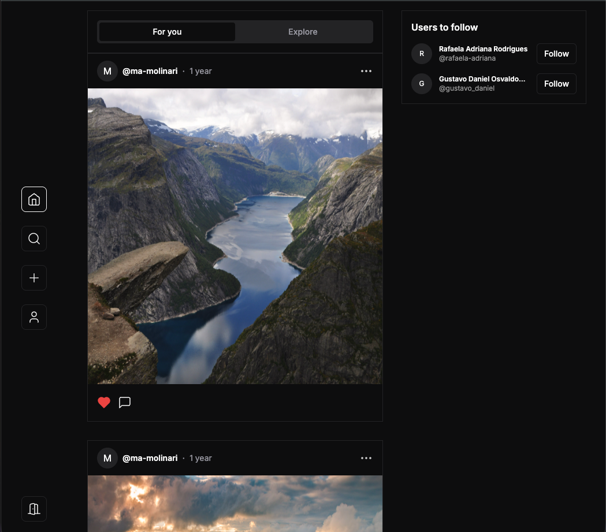

# M-Feed Web

Front-end do **M-Feed**: feed de imagens com autenticação, perfis, comentários e atualizações em tempo real, construído com **Next.js** (App Router) e TypeScript.

## Screenshots




## Funcionalidades

- Autenticação (login e registro) e sessão no cliente
- Feed principal com composição de posts, scroll infinito e estados de carregamento
- Detalhes de post, comentários e menus de ação
- Perfis de usuário (grid de posts, edição de perfil e senha)
- Sugestões de usuários, seguir/deixar de seguir e cartões de utilizador
- Notificações e eventos em tempo real via **SSE** (Server-Sent Events)
- UI com componentes reutilizáveis (Radix UI + Tailwind)

## Stack

| Área                    | Tecnologias                                                                                     |
| ----------------------- | ----------------------------------------------------------------------------------------------- |
| Framework               | [Next.js](https://nextjs.org/) 13 (App Router), [React](https://reactjs.org/) 18                |
| Linguagem               | [TypeScript](https://www.typescriptlang.org/)                                                   |
| Estilo                  | [Tailwind CSS](https://tailwindcss.com/), `tailwindcss-animate`, `class-variance-authority`     |
| Dados remotos           | [TanStack Query](https://tanstack.com/query) (React Query), [Axios](https://axios-http.com/)    |
| Estado global (cliente) | [Zustand](https://github.com/pmndrs/zustand)                                                    |
| Formulários / validação | [React Hook Form](https://react-hook-form.com/), [Zod](https://zod.dev/), `@hookform/resolvers` |
| UI primitiva            | [Radix UI](https://www.radix-ui.com/), [Lucide](https://lucide.dev/)                            |
| Lista / feed            | Virtualização e scroll infinito (`react-cool-virtual`, `react-infinite-scroll-component`)       |
| Feedback                | Toasts (API imperativa em `src/components/ui/use-toast.ts`, Radix + Tailwind)                   |

## Estrutura do código (resumo)

- `src/app/` — rotas e layouts (App Router): grupos `(auth)` e `(main)`
- `src/modules/` — telas e componentes por domínio (`auth`, `home`, `profile`)
- `src/services/` — hooks e chamadas à API alinhados ao React Query
- `src/stores/` — stores Zustand (auth, tema, posts, etc.)
- `src/entities/` — tipos e modelos de domínio
- `src/hooks/` — hooks partilhados (ex.: `useSSE` para eventos em tempo real)
- `src/components/` — UI partilhada e blocos do feed
- `src/libs/` — Axios, React Query, utilitários

Aliases TypeScript (exemplos): `@global-components/*`, `@services/*`, `@modules/*`, `@entities/*` (ver `tsconfig.json`).

Documentação interna opcional: pasta `docs/` (arquitetura, integrações, convenções).

## Variáveis de ambiente

Crie um ficheiro `.env.local` na raiz do projeto:

```env
NEXT_PUBLIC_API_URL=http://localhost:8080
NEXT_PUBLIC_WEB_URL=
NEXT_PUBLIC_IMAGE_URL=http://localhost:8080/static
```

A app espera uma **API REST** (e endpoints compatíveis com SSE) na URL definida por `NEXT_PUBLIC_API_URL`. Ajuste `NEXT_PUBLIC_IMAGE_URL` conforme o servidor de ficheiros estáticos do backend.

As três variáveis `NEXT_PUBLIC_*` acima são **validadas com Zod** em `src/configs/environment/index.ts`: URLs inválidas ou em falta fazem falhar o arranque (útil para detetar `.env` mal configurado cedo).

## Requisitos

- [Node.js](https://nodejs.org/) (recomendado: versão LTS compatível com Next.js 13)

## Como executar

```bash
git clone https://github.com/ma-molinari/m-feed-web.git
cd m-feed-web
npm install
npm run dev
```

Abra [http://localhost:3000](http://localhost:3000).

### Scripts npm

| Script                 | Descrição                           |
| ---------------------- | ----------------------------------- |
| `npm run dev`          | Servidor de desenvolvimento         |
| `npm run build`        | Build de produção                   |
| `npm run start`        | Servidor de produção (após `build`) |
| `npm run lint`         | ESLint (`.ts`, `.tsx`)              |
| `npm run lint-and-fix` | ESLint com correção automática      |
| `npm run format`       | Prettier (escrita) em `src/`        |
| `npm run format:check` | Prettier em modo verificação        |
| `npm run test`         | Vitest (watch)                      |
| `npm run test:run`     | Vitest uma execução (CI)            |

O projeto usa **npm** apenas (`package-lock.json`). Para instalar dependências com o mesmo grafo que o CI/local, use `npm install` (há `.npmrc` com `legacy-peer-deps=true` por conflitos de peer entre ESLint e `eslint-config-next`).
